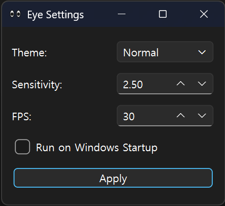

# TwoEye 👀

작업 표시줄 구석에서 마우스 커서를 쳐다보는 귀여운 눈알 위젯입니다.


---

## ✨ **주요 기능** * 👀 **커서 트래킹** : 마우스 움직임을 실시간으로 따라가고, 클릭하면 눈을 깜빡여요.
* 🎨 **다양한 테마** : 일반 눈, 고양이(Cat), 사이보그(Cyborg) 3가지 디자인을 지원합니다.
* 😴 **수면 모드** : 마우스를 2분 이상 가만히 두면 스르륵 잠들어요. 평소에도 자연스럽게 눈을 깜빡입니다.
* ⚙️ **세밀한 설정** : 눈알이 굴러가는 민감도(Sensitivity)와 프레임(FPS)을 조절할 수 있습니다.
* 🚀 **자동 실행** : 윈도우 켤 때 알아서 켜지도록 설정할 수 있어요.

---

## 🚀 **설치 및 실행** 파이썬 환경과 PySide6 라이브러리가 필요합니다.

```bash
pip install PySide6
python twoeye.py
```

---

## ⚙️ 설정 방법 시스템 트레이에 있는 눈알 아이콘을 우클릭해서 Settings 메뉴로 들어갈 수 있습니다.

바꾼 설정은 **.two_eye_config.json** 파일에 저장돼서 껐다 켜도 그대로 유지됩니다.



* Theme : 눈알 디자인을 바꿉니다.
* Sensitivity : 마우스를 따라가는 반응을 조절합니다.
* FPS : 움직임의 부드러움을 조절합니다.
* Run on Windows Startup : 체크하면 윈도우 부팅 시 자동으로 켜집니다.
